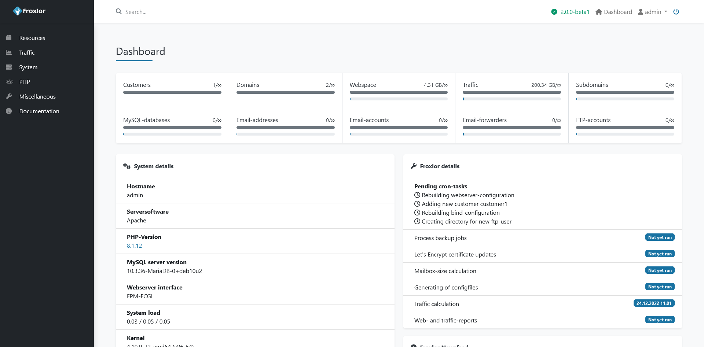

<!--
N.B.: This README was automatically generated by https://github.com/YunoHost/apps/tree/master/tools/README-generator
It shall NOT be edited by hand.
-->

# Froxlor for YunoHost

[](https://dash.yunohost.org/appci/app/froxlor)  

[](https://install-app.yunohost.org/?app=froxlor)

*[Lire ce readme en français.](./README_fr.md)*

> *This package allows you to install Froxlor quickly and simply on a YunoHost server.
If you don't have YunoHost, please consult [the guide](https://yunohost.org/#/install) to learn how to install it.*

## Overview

Froxlor is the lightweight server management software for your needs.

**Shipped version:** 2.0.19~ynh1

## Screenshots



## Documentation and resources

* Official app website: <www.froxlor.org>
* Official admin documentation: <https://docs.froxlor.org/latest/>
* Upstream app code repository: <https://github.com/Froxlor/Froxlor/>
* YunoHost documentation for this app: <https://yunohost.org/app_froxlor>
* Report a bug: <https://github.com/YunoHost-Apps/froxlor_ynh/issues>

## Developer info

Please send your pull request to the [testing branch](https://github.com/YunoHost-Apps/froxlor_ynh/tree/testing).

To try the testing branch, please proceed like that.

``` bash
sudo yunohost app install https://github.com/YunoHost-Apps/froxlor_ynh/tree/testing --debug
or
sudo yunohost app upgrade froxlor -u https://github.com/YunoHost-Apps/froxlor_ynh/tree/testing --debug
```

**More info regarding app packaging:** <https://yunohost.org/packaging_apps>
